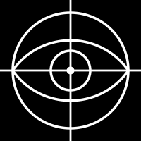

<p align="center">
  
</p>

# ARGUS — Global Conflict Event Tracker

A dense, information-rich OSINT dashboard for tracking global conflict events in near real-time. Built with React, Mapbox GL, and Recharts — styled as a Palantir Gotham / Bloomberg Terminal-style operational analytics tool.

Data is sourced from the **GDELT 2.0 Event Database** — a free, public dataset that updates every 15 minutes and covers conflict events worldwide using CAMEO event codes and the Goldstein Scale for severity scoring.

## Quick Start

### Installation
Dependencies are already installed. If needed, run:
```bash
npm install
```

### Development
Start both the Vite dev server and Express backend with one command:
```bash
npm run dev
```

Or run them separately:
```bash
npm run dev:client  # Vite on localhost:5173
npm run dev:server  # Express on localhost:3001
```

### Configuration
Copy `.env.example` to `.env` and configure:
```env
VITE_MAPBOX_TOKEN=   # Required for live map tiles (Mapbox GL)
```

No API keys are required for conflict event data — GDELT is fully public. The app falls back to mock data if the Mapbox token is missing.

## Features

- **Interactive Map**: Mapbox GL map with clustered conflict event markers, color-coded by event type and severity
- **Event Feed**: Sortable, filterable table of recent events with key metrics (impact score, media mentions, source links)
- **Event Detail Panel**: Expanded view of individual events with CAMEO codes, Goldstein scores, actor info, and source URLs
- **Time Series Chart**: Event count trends over time grouped by event type
- **Smart Filtering**: Filter by event type, country/region, date range, and impact score threshold
- **Statistics Bar**: Live aggregate stats — total events, affected countries, highest-impact event, most active actors
- **Dark Theme**: Palantir Gotham-inspired UI with monospace data display and no soft UI

## Project Structure

```
argus/
├── server/
│   ├── index.js           # Express backend — GDELT proxy + caching layer
│   ├── gdeltFetcher.js    # GDELT 2.0 ZIP/CSV downloader and parser
│   └── mockData.js        # Fallback mock conflict events (GDELT-format)
├── src/
│   ├── main.jsx
│   ├── App.jsx            # Main layout and state management
│   ├── index.css          # Dark theme with Tailwind + custom styles
│   ├── components/
│   │   ├── Header.jsx
│   │   ├── StatsBar.jsx
│   │   ├── FilterPanel.jsx
│   │   ├── MapView.jsx
│   │   ├── EventFeed.jsx
│   │   ├── EventDetailPanel.jsx
│   │   └── TimeChart.jsx
│   ├── hooks/
│   │   └── useEventData.js
│   └── utils/
│       └── constants.js
├── vite.config.js
└── package.json
```

## API

### Backend Endpoints

**GET /api/health**
```bash
curl http://localhost:3001/api/health
```

**GET /api/events**
Fetch conflict events with optional filtering:
```bash
curl "http://localhost:3001/api/events?limit=100&days=7"
```

Query parameters:
- `limit` — Max results (default: 100)
- `days` — Lookback window in days (default: 7)
- `event_type` — Filter by CAMEO-derived event type
- `country` — Filter by country name

### Data Source

GDELT 2.0 Event Database is fetched directly from `data.gdeltproject.org` — no credentials required. The backend caches parsed results and pre-warms the cache on server startup. Events include:

- **CAMEO event codes** — standardized conflict event taxonomy
- **Goldstein Scale** — numeric conflict/cooperation score (-10 to +10)
- **Impact score** — derived from inverted Goldstein scale (0–10, higher = more severe)
- **Media mention count** — proxy for event significance
- **Source URLs** — links to original news coverage

## Technologies

- **Frontend**: React 19, Vite, Tailwind CSS v4
- **Maps**: Mapbox GL JS, react-map-gl
- **Charts**: Recharts
- **Backend**: Express.js, CORS
- **Data**: GDELT 2.0 Event Database (public, no auth required)
- **Fonts**: JetBrains Mono (data), Inter (UI)

## Design Philosophy

- Dense, analytical layout optimized for information density over visual comfort
- No rounded corners or soft UI — sharp, functional, operational aesthetic
- Dark theme with muted background tones and bright accent colors for data
- Monospace fonts for all numerical and event data
- Color-coded event types: battles, explosions, protests, strategic, riots, violence
- Inspired by Palantir Gotham, Bloomberg Terminal, and military C2 dashboards

## Build

```bash
npm run build   # Production build
npm run preview # Preview built app
```
