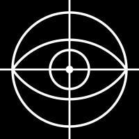

<p align="center">
  
</p>

# ARGUS, Global Conflict Intelligence Dashboard

**[Live Demo](https://argusosint.vercel.app)**

Argus turns the raw, noisy GDELT 2.0 news-event firehose into a usable conflict picture. Its thesis is signal from noise: most of the engineering here is about rejecting the roughly two thirds of "conflict" events that are actually domestic crime, sports, court rulings, and opinion pieces miscoded by GDELT's NLP, then presenting only what survives with honest provenance and a transparent severity score.

---

## The Problem

GDELT 2.0 processes global news every 15 minutes and extracts events using an NLP pipeline trained on the CAMEO conflict ontology. The coverage is extraordinary. The signal quality is not.

The core failure mode is CAMEO misclassification: the same code that means "Use conventional military force" (CAMEO 190) gets applied to "Travelers fight TSA policy" or "Police respond to road rage." GDELT's structural filters, QuadClass, root codes, and the Goldstein scale, all derive from the same NLP output and inherit the same errors. Filtering on `QuadClass = 4 (Material Conflict)` does not fix this; it reduces volume while keeping the misclassification rate roughly constant.

A second failure mode is actor extraction. GDELT's `Actor1Name` and `Actor2Name` are pulled from article prose, so they are frequently common nouns ("Gunman", "Police"), civilian roles ("Worshipper"), facilities ("Military Base"), or bare place names rather than real belligerents. Surfacing those as named actors is misleading.

A raw GDELT feed for "conflict events" is therefore worse than useless for an analyst: it trains people to ignore the dashboard.

---

## What Argus Does

Argus is a conflict intelligence dashboard built on GDELT 2.0 as its real-time layer. Each refresh it:

1. Downloads recent GDELT export files and normalizes them to a single internal schema.
2. Runs a multi-stage noise-reduction pipeline: structural CAMEO and QuadClass gating, geographic validation, URL and domain rejection, a stable-country domestic-noise filter, and a Claude Haiku classification gate for the genuinely ambiguous cases.
3. Deduplicates multi-outlet reporting of the same incident into one event while preserving aggregate coverage counts.
4. Scores every event on a transparent 0 to 10 severity model that actually discriminates between events.
5. Cross-references kinetic events against NASA FIRMS satellite thermal data for independent corroboration.
6. Merges in UCDP GED as a validated historical baseline when a UCDP token is configured.

The frontend is a dense, operational interface (React 19, Mapbox GL) that shows source provenance at every layer, so an analyst always knows whether they are looking at a peer-reviewed fatality estimate, a satellite-corroborated signal, or a raw NLP-extracted news event.

---

## Architecture

```
GitHub Actions (daily cron)            Vercel
  scripts/refresh-events.js              api/events.js  ->  React SPA
    GDELT fetch + Haiku filter   ---->   reads Vercel   ---->  (Mapbox GL)
    UCDP fetch (if token)                Blob, 15 min
    merge + dedup + score                CDN cache
    write to Vercel Blob
```

The browser reads exclusively from `GET /api/events`. That serverless function serves the pre-filtered event set from Vercel Blob (written by the scheduled refresh job) behind a 15-minute edge cache. If the Blob is empty (first deploy), it falls back to a live GDELT fetch, and finally to a small mock set, so the page never renders empty. A local Express server (`server/index.js`) mirrors the same API routes for development.

The heavy, slow, and paid work (downloading GDELT, running Haiku) happens once per day in CI, not on the request path. Page loads are fast and predictable and never trigger an LLM call.

Note: the client applies two final display-layer passes on load. It resolves actor names (see below) and recomputes severity, so the currently cached data is presented cleanly even between refreshes.

---

## Data Pipeline

The pipeline runs as a GitHub Actions cron job at 12:00 UTC daily, with manual `workflow_dispatch` before a live demo. GDELT and UCDP are both backward-looking, so a daily pull keeps the dashboard current while keeping Anthropic spend bounded.

1. **GDELT fetch.** Last 7 days of export files in 6-hour steps. Only QuadClass 3 to 4 with kinetic CAMEO root codes (18 assault, 19 fight, 20 mass violence, plus 145 violent riot and select 15x force-posture codes) are kept. Verbal threats (13), protest (14), diplomatic reduction (16), and coercion (17) are dropped.
2. **Structural pre-filter.** URL slug rejection (family law, sports, entertainment, domestic crime patterns), a source-domain blocklist, a US-local-news detector for foreign events, a source-count threshold, and a stable-country civilian-noise filter. This removes the bulk of noise at zero LLM cost.
3. **Actor normalization.** Country-as-actor expansion, US-state and city demotion, nationality-adjective handling, and generic-title demotion.
4. **Haiku classification.** Events that clear the structural gates but cannot be auto-passed are sent to Claude Haiku for a five-dimension scored assessment (credibility, severity, specificity, novelty, conflict relevance) with a one-line reasoning note and tags. Auto-pass is reserved for hard armed-actor events (MIL, REB, UAF, SPY) with an extreme Goldstein value and multi-outlet coverage, outside high-false-positive stable countries, so diplomatic and domestic stories are never rubber-stamped.
5. **Deduplication.** Multi-outlet reporting of one incident is collapsed in two passes: exact `source_url` matches, then a composite fingerprint (date, type, actor, country) combined with a 50 km geographic proximity check. The surviving canonical event inherits the summed mention and source counts, so aggregate coverage is preserved rather than lost.
6. **UCDP merge.** When `UCDP_API_TOKEN` is set, UCDP GED events (2023 to 2024) are fetched, tagged `source='ucdp'`, and merged into the set with their fatality estimates. They bypass Haiku because they are already expert-validated.
7. **Score and write.** Every event is severity-scored (see below), the set is sorted by date and capped at 800, and written to Vercel Blob with a `fetchedAt` timestamp.

---

## Actor Resolution

The single most visible noise source is the ACTOR field. Argus never shows a raw GDELT actor string. Instead, `src/utils/actors.js` resolves an actor only when it can positively identify one:

- a state force expressed as nationality plus role ("Israeli Military", "Nigerian Forces", "Ukrainian Government"),
- a whitelisted named armed group (Boko Haram, Hezbollah, Hamas, Houthis, Wagner, ISWAP, RSF, and others),
- or an intergovernmental organization (NATO, United Nations, European Union).

The GDELT actor type code is used to reject civilian, media, education, business, NGO, and judicial entities. Anything that does not positively resolve, including bare country and city names and generic nouns, is shown as **"Unattributed"** rather than presented as a belligerent.

This is done at the display layer on purpose. In underreported conflict zones a real attack is often coded with only "Gunmen" or "Bandit" as the actor; demoting those to nothing in the data would trip the pipeline's both-actors-unknown rejection and silently delete genuine violence. Cleaning at display keeps the event and never shows a misleading actor.

---

## Scoring Methodology

GDELT's Goldstein value is a fixed lookup keyed on the CAMEO code, so nearly every kinetic event sits at or near -10. Using it as the dominant severity term made almost every event score 7 or 8. Argus keeps Goldstein as one input and adds axes that actually vary.

Severity is a 0 to 10 weighted composite (`src/utils/scoring.js`, mirrored server-side):

| Component | Weight | Source |
|---|---|---|
| Kinetic intensity | 40% | Event type and sub-event CAMEO tier (mass killing and airstrike rank above a generic fight) |
| Media reach | 20% | Log-scaled mention count |
| Corroboration | 15% | Log-scaled distinct source outlets |
| Goldstein baseline | 15% | Inverted Goldstein scale |
| Coverage tone | 10% | Inverted average tone (more hostile is higher) |

A small boost is added when NASA FIRMS satellite data corroborates the location. The score is recomputed on the client at load, so it is consistent across the Blob, live, and mock data paths, and the event detail panel exposes the full per-component derivation so the number is auditable rather than opaque.

---

## Analyst Feedback

Analysts can mark an event as noise (dismiss) or confirm it as a valid signal. Both persist server-side to Vercel Blob via `POST /api/events/:id/dismiss` and `:id/confirm`, survive redeploys, and are returned on load so the state is reflected in the UI. Dismissed events are stripped from the served feed; confirmed events are visually marked and are never removed by the relevance gate.

---

## Data Sources

| Source | Role | Coverage | Auth |
|---|---|---|---|
| [GDELT 2.0](https://www.gdeltproject.org/) | Live conflict signal layer | Rolling 7-day window | None |
| [UCDP GED](https://ucdp.uu.se/downloads/) | Validated historical baseline with fatality estimates | 2023 to 2024, annual, lags ~1 year | API token |
| [NASA FIRMS](https://firms.modaps.eosdis.nasa.gov/) | Satellite corroboration of kinetic events | Rolling 3-day VIIRS | API key |
| [ReliefWeb / UN OCHA](https://reliefweb.int/help/api) | Humanitarian context per country | Ongoing | None |
| [POLECAT](https://doi.org/10.7910/DVN/AJGVIT) | Historical backtest baseline | 2018 to present | None |

UCDP is explicitly not a live layer. It is annual, expert-coded, and typically about a year behind the present, so Argus uses it as a validated baseline for calibration and backtesting, not as a real-time source. The two datasets coexist in the feed tagged by source; they are not joined on a shared key.

---

## Event Schema

```js
// GDELT event
{
  event_id_cnty:      string,
  event_date:         string,      // 'YYYY-MM-DD'
  event_type:         string,      // 'Battles' | 'Explosions/Remote violence' | ...
  sub_event_type:     string,      // human-readable CAMEO description
  actor1, actor2:     string,      // raw GDELT names; resolved for display client-side
  actor1_type, actor2_type: string,// GDELT type codes (MIL, GOV, REB, ...)
  country, location:  string,
  latitude, longitude: number,
  goldstein_scale:    number,      // -10 to +10
  num_mentions, num_sources: number,
  impact_score:       number,      // 0 to 10, see scoring
  severity_breakdown: object,      // per-component derivation
  avg_tone:           number,
  source_url:         string|null, // GDELT SOURCEURL, null when root-domain only
  source:             'gdelt',
  ai_classification:  object|null, // Haiku assessment when present
  satellite_corroborated: boolean,
}

// UCDP event adds
{ source: 'ucdp', fatalities_best, fatalities_low, fatalities_high, ... }
```

---

## Known Limitations

Honest about where the seams are:

- **GDELT actor extraction is unreliable.** Actor names are NLP-extracted from prose and are often generic nouns or places. Argus mitigates this by resolving only positively identifiable actors and labeling the rest "Unattributed," which means some real but unlisted groups are shown as Unattributed rather than named. This is a deliberate precision-over-recall choice.
- **Geocoding false positives.** GDELT sometimes geolocates a domestic story to a foreign country, or scores local news as armed conflict. The stable-country filter and a client-side relevance gate catch the common cases (for example a US county event with no resolved actor and weak sourcing), but this is a heuristic and will occasionally over- or under-filter.
- **UCDP lag.** UCDP GED is annual and trails the present by roughly a year. It is a validated baseline, not current intelligence, and is labeled as such throughout.
- **Deduplication is approximate.** Collapsing multi-outlet reports uses exact URL matches plus a date, type, actor, country fingerprint within 50 km. Two genuinely distinct incidents in the same town on the same day can be merged, and the same incident geocoded far apart by different outlets can be missed.
- **Severity is a heuristic proxy, not ground truth.** The 0 to 10 score is a transparent weighted composite designed to rank and triage, not a validated casualty or intensity estimate. Its inputs are documented so it can be recalibrated.
- **One source URL per event.** GDELT's export records a single representative `SOURCEURL`. The mention and outlet counts reflect total coverage, but Argus links to that one article rather than to every outlet.

---

## Quick Start

```bash
npm install
cp .env.example .env.local   # populate required vars
npm run dev                   # Vite (5173) + Express (3001)
```

### Environment Variables

```env
VITE_MAPBOX_TOKEN=       # Required, Mapbox GL map tiles
ANTHROPIC_API_KEY=       # Required, Haiku classification + country SITREPs
NASA_FIRMS_API_KEY=      # Optional, satellite corroboration
UCDP_API_TOKEN=          # Optional, UCDP GED baseline
BLOB_READ_WRITE_TOKEN=   # Required in prod, set automatically on Vercel
```

---

## Project Structure

```
argus/
├── server/
│   ├── index.js            # Express dev server, mirrors the api routes
│   ├── gdeltFetcher.js     # GDELT download, parse, normalize, dedup
│   ├── haikuFilter.js      # Claude Haiku classification gate
│   ├── scoring.js          # severity model (kept in sync with src/utils/scoring.js)
│   ├── ucdpFetcher.js      # UCDP GED client
│   ├── firmsService.js     # NASA FIRMS corroboration
│   ├── feedbackStore.js    # analyst dismiss/confirm persistence
│   └── blobCache.js        # Vercel Blob read/write
├── api/                    # Vercel serverless functions (events, brief, firms)
├── scripts/refresh-events.js  # the daily pipeline
├── src/
│   ├── App.jsx
│   ├── components/         # Header, MapView, EventFeed, EventDetailPanel, ...
│   ├── hooks/useEventData.js
│   └── utils/
│       ├── actors.js       # actor resolution + relevance gate
│       ├── scoring.js      # severity model
│       └── text.js
└── .github/workflows/refresh-events.yml   # daily cron
```

---

## Technologies

- **Frontend:** React 19, Vite, Mapbox GL JS, Recharts
- **Backend:** Vercel serverless functions, Express for local dev
- **AI:** Claude Haiku for event classification and country SITREPs
- **Storage:** Vercel Blob, written by GitHub Actions, read by the API
- **Pipeline:** Node.js and Python 3
```
